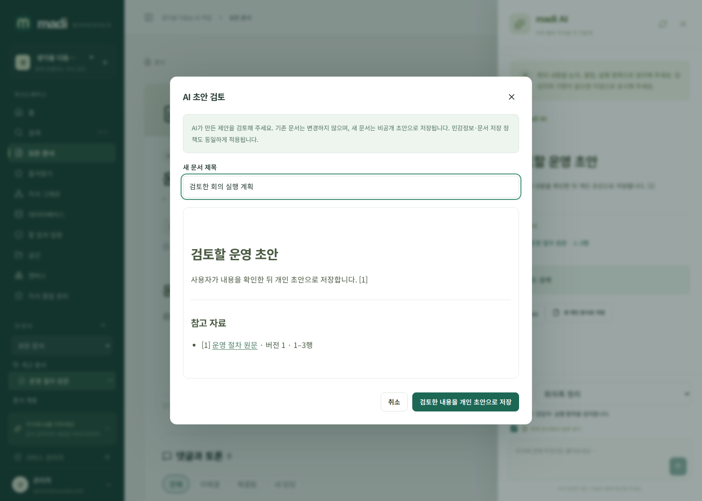
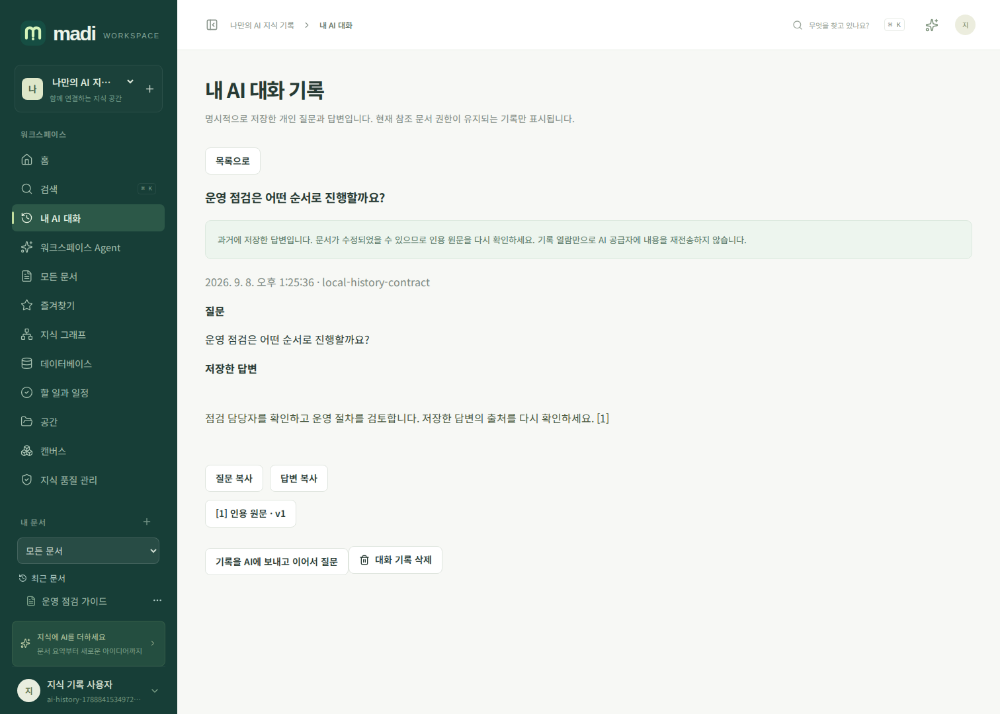

# AI 문서 작업과 개인 대화 기록

madi의 AI는 관리자가 연결한 OpenAI 호환 모델을 사용합니다. 사내 vLLM/Ollama/API Gateway처럼 내부 주소만 설정해 폐쇄망에서 운영할 수 있습니다. 실제 기능은 모델의 스트리밍·컨텍스트·출력 한도에 영향을 받습니다. 서비스가 허용하는 최대 출력 요청은 262144 토큰이며 모든 모델이 이를 지원한다는 뜻은 아닙니다.

## 문서 지원 작업

상단 AI 도우미를 열고 **AI 작업**을 선택합니다. 기본 질문 외에 초안 작성, 문장 개선, 요약, 번역, 태그 추천, 관련 링크 추천, 중복 내용 검토, 회의록 정리, 템플릿 만들기, 부족한 지식 찾기를 제공합니다. 작업을 선택하면 편집 가능한 질문 예시가 채워집니다. 번역 언어·분량·문서 목적·대상을 질문에서 구체화하세요.

답변은 처음부터 스트리밍됩니다. 문서·태그·관계·할 일을 자동 변경하지 않으며 검색 결과의 범위 밖까지 검사한 것으로 간주하지 않습니다. 원문은 인용 버튼으로 현재 권한·버전·해시를 검증해 확인할 수 있습니다.

결과를 문서로 쓰려면 `새 개인 문서로 저장`을 선택하고 제목·본문·출처 목록을 미리보기에서 검토하세요. 저장은 기존 편집 중인 문서를 덮지 않고 새 비공개 초안을 만듭니다. 참조 문서가 바뀌면 재생성을 안내하며, 저장 시 서비스의 민감정보 정책을 그대로 적용합니다. 공개·공유·승인은 기존 문서 메뉴에서 별도로 결정합니다.

## 개인 대화 저장

대화는 자동 보관되지 않습니다. 완료된 답변에서 `개인 대화 기록에 저장`을 누르고 동의하면 질문·답변·인용을 서버에 저장합니다. 서버가 발급한 사용자별 암호화 티켓은 1시간 동안 유효합니다. 변조·다른 사용자 재사용·현재 권한이나 공급자 변경은 거부하며 같은 티켓의 재전송으로 기록을 중복 생성하지 않습니다.

`내 AI 대화` 메뉴에서 조회·검색·인용 확인·삭제할 수 있습니다. 통합 검색의 `내 AI 대화` 종류에도 나타납니다. API 키·플러그인·다른 사용자·서비스 관리자에게 개인 기록 조회 권한을 부여하지 않습니다. 참조 문서 접근이 회수되면 목록·검색·본문에서도 숨깁니다. 열린 기록은 주기적으로 현재 권한을 재검사해 접근이 사라진 본문을 화면에서 지웁니다. 이미 복사한 텍스트까지 회수하는 DRM은 아닙니다.

기록은 일반 문서처럼 PostgreSQL과 서버 백업에 보관됩니다. 위의 개인 권한은 madi 서비스 API/UI 경계이며 DB·서버·백업 자체를 관리하는 운영자에 대한 종단간 암호화가 아닙니다. 비밀 공급자 키는 기록하지 않습니다. 기록 삭제는 앱에서 되돌릴 수 없고 기존 백업 사본의 보존은 운영 정책에 따릅니다.

## 선택한 대화에서 이어서 질문

저장한 기록에서 `기록을 AI에 보내고 이어서 질문`을 선택한 경우에만 이전 질문·답변을 동일한 공급자에게 재전송합니다. 기록을 읽거나 검색하는 것만으로 모델을 호출하지 않습니다. 과거 출처는 현재 ACL·버전·원문 해시·색인 동의를 다시 검증합니다. 공급자 설정이나 참조 버전이 바뀌면 자동 재전송하지 않고 새 대화를 안내합니다.

후속 답변도 완료 후 명시적으로 저장해야 기존 대화에 추가됩니다. 다른 탭에서 같은 대화가 바뀌면 409 충돌로 알려 주며 기록을 덮어쓰지 않습니다. 저장한 대화는 최대 20개 답변·16MiB, 모델에 다시 보낼 과거 질문/답변은 128KiB·과거 원문 조각은 96KiB로 제한합니다. 과도한 기록은 잘라서 의미를 바꾸지 않고 새 대화 시작을 안내합니다. 답변 자체는 4MiB, 암호화 저장 티켓의 직렬화 원본은 5MiB 이하입니다.

## API

- `GET /api/v1/ai/actions`: 지원 작업과 이름·질문 예시.
- `POST /api/v1/ai/chat`: `prompt`, `workspace_id`, 선택적 `document_id`, `action`, `max_tokens`. 이어서 질문할 때는 `conversation_id`와 `conversation_version`도 함께 지정합니다.
- `POST /api/v1/ai/conversations`: 완료 SSE의 `history_ticket`을 `ticket`으로 보내고 `consent:true`로 명시 저장.
- `GET /api/v1/ai/conversations?workspace_id=…&q=…&offset=…`: 본인 기록의 40개 단위 검색.
- `GET /api/v1/ai/conversations/{id}`: 현재 권한 내 질문·답변·출처.
- `DELETE /api/v1/ai/conversations/{id}`: `version`과 `confirmation:"DELETE"`로 삭제.

개인 기록 API는 로그인 쿠키와 변경 요청의 `X-Madi-Request: 1` 헤더를 사용합니다. `retract:true` SSE를 수신한 클라이언트는 답변·출처·저장 티켓을 모두 지워야 합니다. AI 답변을 중요한 업무 판단에 사용할 때는 원문과 담당자의 검토를 거치세요.
