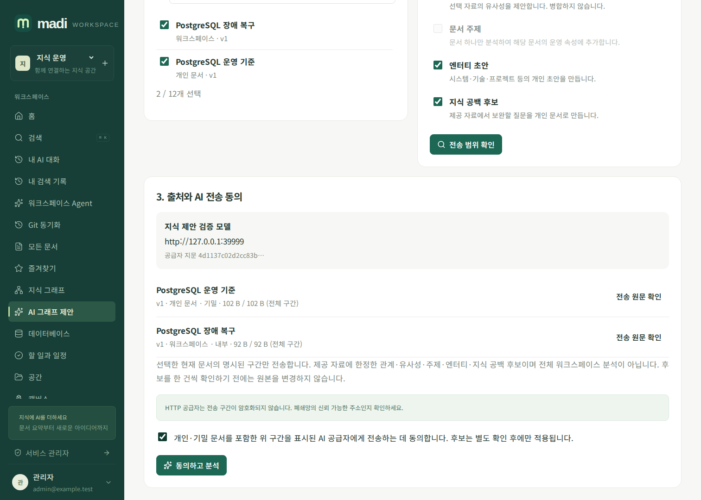
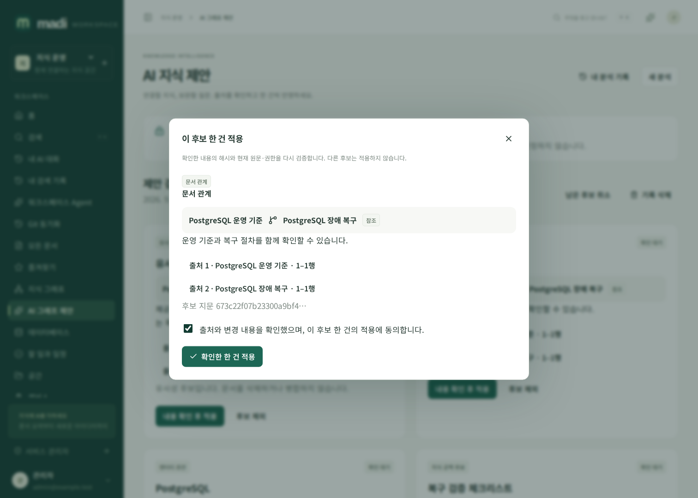

# AI 지식 제안 가이드

madi의 **AI 지식 제안**은 선택한 문서에서 문서 관계, 유사·중복 후보, 주제, 엔터티와 지식 공백 후보를 생성합니다. 워크스페이스 전체를 완전히 분석했다고 판단하지 않으며, 검색 이력을 수집하거나 자동으로 지식을 확정하지 않습니다.

## 사용 순서

1. 사용자 메뉴의 **AI 지식 제안**에서 현재 열람 가능한 문서 1~12개를 고릅니다.
2. 원하는 제안 종류를 선택합니다. **문서 주제**는 문서를 하나만 선택한 경우 사용할 수 있습니다.
3. **전송 범위 확인**에서 AI 공급자 주소·모델, 문서 공개 범위·보안 등급, 전송할 원문 구간을 확인합니다. 긴 문서는 앞부분만 포함될 수 있습니다.
4. 개인·기밀 문서를 포함한 해당 구간의 전송에 동의한 뒤 **동의하고 분석**을 누릅니다. AI가 구성되어 있지 않으면 분석하지 않습니다.
5. 결과 카드의 **출처**로 정확한 원문 구간을 대조합니다. **내용 확인 후 적용**에서 해당 후보 한 건의 적용에 다시 동의합니다. 원하지 않는 후보는 제외합니다.

미리보기 이후 원문·권한·AI 공급자·모델·정책이 바뀌면 동의를 다시 받아야 합니다. API 비밀값은 화면에 표시하지 않습니다. 공급자가 HTTP인 경우 전송 암호화가 없으므로 신뢰 가능한 내부망에서만 사용하세요.

## 무엇이 변경되나요?

| 제안 | 확인 후 결과 |
| --- | --- |
| 문서 관계 | 현재 수정 권한이 있는 출발 문서에서 관련/참조 관계 생성 |
| 유사·중복 후보 | 관련 관계만 생성. 원문 삭제·병합 없음 |
| 문서 주제 | 그 문서 하나만 분석한 주제를 운영 속성의 `system_metadata.ai_topics`에 추가. Markdown·Front Matter 불변 |
| 엔터티 초안 | 기존 엔터티 기능을 통해 개인 초안 생성, 근거 문서와 연결 |
| 지식 공백 후보 | 제공된 구간에서 추가로 확인할 질문과 목차를 개인 문서 초안으로 생성 |

새 문서는 입력 문서 중 가장 높은 보안 등급을 상속합니다. 초안의 공개 범위를 변경할 때는 내용을 검토하세요. 승인 프로세스를 설정한 서비스에서는 기존 문서 게시 정책을 따릅니다.

여러 자료에서 추론한 주제를 상대적으로 공개된 한 문서에 저장하면 나중의 공유 변경으로 민감한 추론이 노출될 수 있습니다. 그래서 주제는 **단일 입력 문서만** 허용합니다. 관계·중복 제안의 이유와 상세 근거는 모든 입력 문서의 현재 접근을 검사하는 개인 분석 기록에만 보관합니다.

## 기록, 취소, 재접속

- **내 분석 기록**은 본인 소유이고 현재 모든 원본을 열람할 수 있는 기록만 표시합니다. 서비스 관리자도 다른 사용자의 기록이나 개인 문서 권한을 우회하지 않습니다.
- 새로고침한 메뉴와 실행 ID는 URL로 유지됩니다. 새로 열어도 AI를 다시 호출하지 않습니다.
- **분석 취소** 또는 **남은 후보 취소**는 진행 중인 분석과 미적용 후보를 취소합니다. 이미 적용한 자료는 그대로입니다.
- 기록 삭제는 분석 이력만 삭제합니다. 생성된 정식 문서·관계·주제는 보존됩니다.
- 네트워크 종료·서버 재시작으로 전경 실행이 끊기면 자동 재전송하지 않습니다. 종료 처리가 불가능했던 실행도 5초 이상 유효한 heartbeat가 없으면 조회/유지관리 시 취소됩니다.
- 실행의 최대 시간은 10분, 적용 확인은 최초 생성 후 24시간 이내 및 원래 유효한 로그인/동의/권한 조건에서만 가능합니다.

## 운영자 설정과 보안

서비스 또는 워크스페이스의 기존 AI 설정을 사용합니다. 별도 환경변수나 추가 외부 서비스가 필요하지 않습니다. **기능 정책 → AI 지식 그래프**를 끄면 신규 실행 및 실행 중인 외부 호출이 차단됩니다. 스트림은 응답마다, 무응답 중에도 약 1초 간격으로 현재 권한·원문·공급자·정책을 재검증합니다.

후보의 제목·설명·이유·주제에는 현재 정보보호 정책을 적용한 뒤 저장합니다. 모델이 반환한 인용은 정확히 일치하는 원문만 허용하며, 기록에는 원문 발췌 대신 버전·UTF-8 구간·해시를 보관합니다. 모델 출력은 명령으로 실행하지 않습니다. 임의 URL 호출, 셸, Runbook 실행 도구는 이 기능에 없습니다.

백업 복원은 실행 중 요청과 미적용 후보를 취소하고 세션 연결값을 제거합니다. 과거 후보를 무인 재전송하거나 자동 적용하지 않습니다. 기존 정식 자료는 일반 백업 정책으로 복원합니다.

## API

세부 스키마와 응답은 서비스의 `/api/v1/openapi.json`에서 확인할 수 있습니다.

| 메서드·경로 (`/api/v1` 기준) | 용도 |
| --- | --- |
| `GET /workspaces/{id}/graph-ai/context?document_ids=UUID,UUID` | 정확 전송 범위·공급자 미리보기 |
| `POST /workspaces/{id}/graph-ai/analyze` | 새 요청 UUID·미리보기 스냅샷·공급자 지문·종류·명시 동의로 실제 SSE 분석 |
| `GET /workspaces/{id}/graph-ai/runs` | 현재 접근 가능한 본인 기록 최대 50개 |
| `GET /graph-ai/runs/{id}` | 출처 재검증 및 후보 확인 |
| `POST /graph-ai/actions/{id}/confirm` | `action_hash`와 `confirm:true` 또는 `reject:true`로 단건 판단 |
| `POST /graph-ai/runs/{id}/cancel` | 진행·미적용 후보 취소 |
| `DELETE /graph-ai/runs/{id}` | 개인 기록 삭제, 이미 적용한 자료 보존 |

조회·분석은 `document:read`와 `ai:execute`를 모두 요구합니다. API 키·서비스 계정·플러그인은 해당 제약의 교집합 안에서 분석할 수 있지만 후보 적용은 실제 일반 사용자 쿠키 세션에서의 명시적인 확인만 허용합니다. 적용에는 `document:write` 및 원래 호출 권한 상한도 필요합니다.

현재 상한은 선택 원문 총 16MiB, 전송 구간 합계 48KiB, JSON 인코딩 입력과 모델 출력 각각 64KiB, 후보 30개, 후보당 검증 근거 6개입니다. 사용자당 동시 전경 분석은 2개입니다. 모델 토큰 한도는 기존 AI 설정의 최대 262,144 범위이며 공급자별 실제 지원 한도는 별도로 확인해야 합니다.
