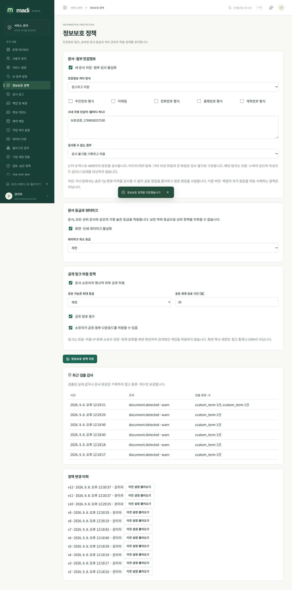
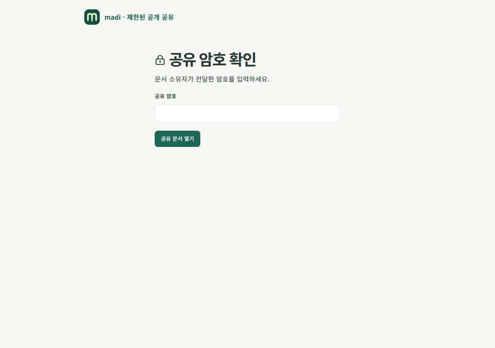
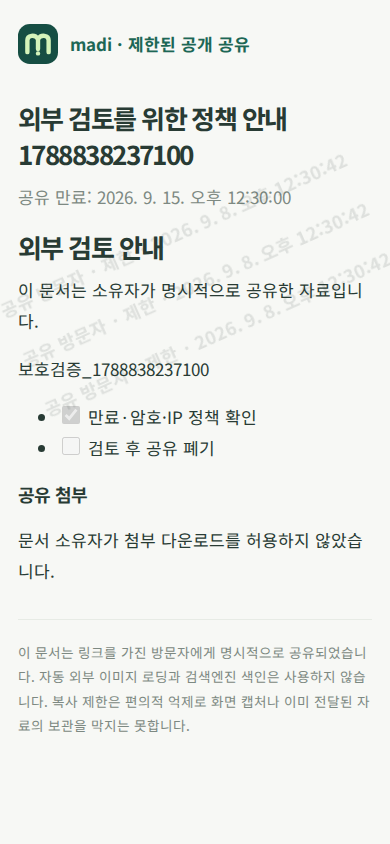

# 정보보호 · 공개 공유 가이드

관리자 `/admin/information-protection`에서 새 문서 저장과 첨부 업로드의 검사 정책을 켭니다. 기본은 꺼짐이며 추가 실행 환경변수는 없습니다. 정책 변경은 버전과 관리자 이력으로 보관하고, 이전 설정을 불러온 뒤 확인하여 다시 저장할 수 있습니다.

## 탐지와 저장

주민번호·국내 전화번호·결제번호·계좌번호와 유사한 형식, 이메일, 관리자가 지정한 문자열을 검사합니다. 패턴은 고정되어 있으며 임의 정규식이나 코드를 실행하지 않습니다. 실제 신원·계좌·카드 유효성을 인증하거나 모든 개인정보를 찾아내는 기능은 아닙니다. 오탐·누락을 고려하여 조직 정책과 별도 검토를 함께 운영하세요.

| 조치 | 동작 |
| --- | --- |
| 경고 | 저장하고 발견한 종류·개수를 응답 및 감사에 표시 |
| 차단 | 발견한 새 내용의 저장을 거부 |
| 마스킹 | 정본을 `MADI_REDACTED`로 치환한 뒤 저장 |
| 감사 | 저장하고 비식별 검출 이력을 기록 |

감사에는 검출된 실제 값이나 문서 원문을 넣지 않습니다. 제목·Markdown·태그·별칭·블록 메타데이터를 검사하고, 문서·버전·자동화 이벤트의 정본이 일치하도록 같은 트랜잭션에서 처리합니다. JSON 키 또는 숫자처럼 자동 치환이 구조를 바꿀 수 있는 항목은 정제를 요구합니다. YAML에 안전한 치환 값을 사용하지만 데이터 의미까지 자동 보증하지는 않으므로 저장 결과를 확인하세요.

데이터베이스 트리거가 차단·마스킹 정책의 미정제 원문 저장을 거부합니다. 가져오기·커넥터·개인 수집도 공통 검사를 거칩니다. 공개 공유는 차단·마스킹 정책에서 아직 정제되지 않은 기존 문서의 외부 제공을 거부합니다.

공개 첨부 다운로드는 과거에 등록된 파일도 실제 읽을 바이트와 이름을 현재 정책으로 다시 검사합니다. 차단·마스킹 대상이 발견되거나 검사 불가 차단 정책에 해당하면 원본을 내려주지 않습니다. 다운로드 도중 임의 치환본을 만들지는 않으며 소유자가 자료를 정제하고 다시 등록해야 합니다.

이는 **새 저장 정책**입니다. 이전 버전, 과거 감사·메타데이터, 이미 만든 백업, 사용자의 로컬 보관함이나 외부 사본을 소급 삭제하지 않습니다. 기존 자료의 정리·보존·파기는 별도 운영 절차로 수행하세요. 가져오기 원본은 암호화 대기 후 완료·취소 시 제거하며 보관 한도는 7일입니다. 개인 Webhook·IMAP의 마스킹은 대기 원본을 암호화 저장하기 전에도 적용합니다.

## 협업과 파일의 한계

Yjs의 삭제된 내용·숨은 변경 이력까지 완전히 검사하지 못하므로 **차단·마스킹 정책에서는 실시간 공동 편집을 중지**합니다. 원문 편집에서 정제하여 저장하고 기존 협업 세대를 새 정본으로 전환합니다. 경고·감사 정책에서는 협업을 사용할 수 있습니다.

첨부는 명시적으로 지원하는 UTF-8 텍스트 4MB까지 본문을 검사합니다. 이미지, PDF, 압축 파일, 기타 이진 형식, 더 큰 파일 또는 다른 문자 인코딩은 검사 불가로 표시합니다. 관리자는 검사 불가 파일을 기록하고 허용하거나 업로드 차단할 수 있습니다. 파일 이름도 검사합니다. 악성코드 검사·OCR·압축 내부 검사·문서 무해화(CDR)를 제공한다고 해석하면 안 됩니다. 파일 형식 확인만으로 안전을 보장할 수 없다는 [OWASP 파일 업로드 지침](https://cheatsheetseries.owasp.org/cheatsheets/File_Upload_Cheat_Sheet.html)도 참고하세요.

## 문서 등급과 워터마크

공개 → 내부 → 기밀 → 제한 순으로 높습니다. 기존 문서 정책과 공간 등급을 재사용하고 모든 상위 문서·공간을 포함한 가장 높은 등급을 적용합니다. 하위 문서에 낮은 등급을 지정해도 상위 제한을 우회하지 않습니다.

관리자가 지정한 등급부터 화면·인쇄에 열람자, 시간, 등급을 표시합니다. 공개 공유의 열람자는 ‘공유 방문자’로 표시합니다. 워터마크와 복사 억제는 표시 기능이지 DRM이 아니며 화면 캡처나 이미 전달된 파일의 복제를 막을 수는 없습니다.

## 공개 링크

서비스 관리자가 외부 공유를 허용한 경우 현재 문서 소유자가 문서의 ‘공개 링크’에서 생성합니다. 비공개 문서도 명시적으로 공유하면 링크 방문자에게 전달되므로 확인 항목을 읽어야 합니다. 다른 관리자·편집자가 소유자를 대신해 공개할 수 없습니다.

만료 시각은 필수이고, 최대 문서 등급·기간·암호 필수·첨부 다운로드 허용은 관리자가 제한합니다. 링크별 암호, 허용 IP/CIDR, 다운로드·복사 선택을 지정할 수 있습니다. IP는 애플리케이션과 직접 연결된 상대 주소를 기준으로 하며 임의 `X-Forwarded-For`를 신뢰하지 않습니다. 리버스 프록시 뒤에서는 프록시 주소가 보일 수 있으므로 네트워크 배치를 함께 확인하세요.

링크는 `/share/{UUID}#비밀` 형식이며 `#` 뒤 값도 포함해야 합니다. 비밀은 한 번만 표시하고 DB에는 해시만 저장합니다. 브라우저는 비밀을 URL 경로나 쿼리가 아닌 `X-Madi-Share-Token` 헤더로 전달합니다. 암호 확인 후 발급하는 제한된 1시간 접근 토큰은 `X-Madi-Share-Access` 헤더로만 보내고 페이지 메모리에 보관합니다. 새로고침하면 암호를 다시 요구할 수 있습니다.

원래 링크 비밀은 재조회할 수 없습니다. 회전하면 새 링크를 발급하고 이전 링크와 암호 확인 세션은 즉시 무효화합니다. 설정 변경도 기존 암호 확인 세션을 무효화합니다. 폐기, 만료, 소유자의 권한 상실·계정 중지, 분류 상향, 관리자 중지 정책을 요청마다 다시 확인합니다. 장시간 첨부 전송도 주기적으로 재검사하지만 이미 전송된 바이트를 회수할 수는 없습니다.

공개 화면은 로그인 화면과 분리되고 HTML 실행·자동 외부 이미지 다운로드를 허용하지 않습니다. `noindex`, `no-store`, `no-referrer`를 사용하고 암호 확인·읽기·다운로드 이력을 보관합니다. 비밀번호 시도는 링크·IP당 5분에 5회, 공개 요청은 직접 연결 IP당 분당 120회로 제한합니다. 비밀 링크의 안전한 저장, 만료와 참조 유출 방지는 [OWASP 토큰 취급 지침](https://cheatsheetseries.owasp.org/cheatsheets/Forgot_Password_Cheat_Sheet.html)의 보안 원칙을 참고했습니다. 공개 링크는 비밀번호 재설정 토큰과 달리 유효 기간 안의 반복 열람을 허용합니다.

백업 복원 후 공개 공유 정책은 꺼지고 과거 링크는 모두 폐기합니다. 이전 방문자의 토큰으로 새 환경에 접근할 수 없습니다. 새 운영 환경에서 문서 소유자가 다시 확인하여 공유하세요.

## 검증 범위

PostgreSQL race 검사에서 정본·JSON·YAML 마스킹, DB 직접 변경 차단, 숨은 협업 상태 접근 차단, 첨부 형식 구분, 상위 분류, 공유 암호·만료·키 회전·권한 회수·다운로드 경계를 검증합니다. 실제 운영 환경의 민감정보 유형과 프록시·보존 정책에 대한 수용 시험은 별도로 필요합니다.

실제 Chromium에서 관리자 선택 옵션 저장, 상속 등급·워터마크, 소유자 공유 생성, 익명 암호 확인 전 본문 차단, 공유 폐기 후 본문 제거, 390px 모바일 표시와 콘솔·서버 오류 부재를 확인했습니다. 캡처는 실행한 개발 서비스의 테스트 자료입니다.

