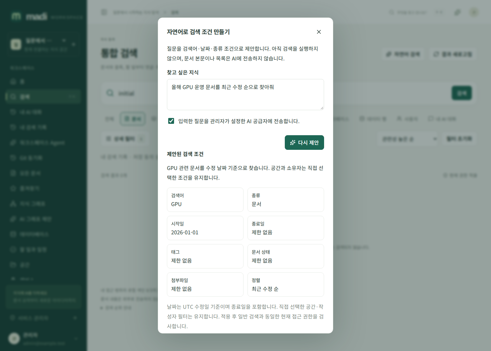
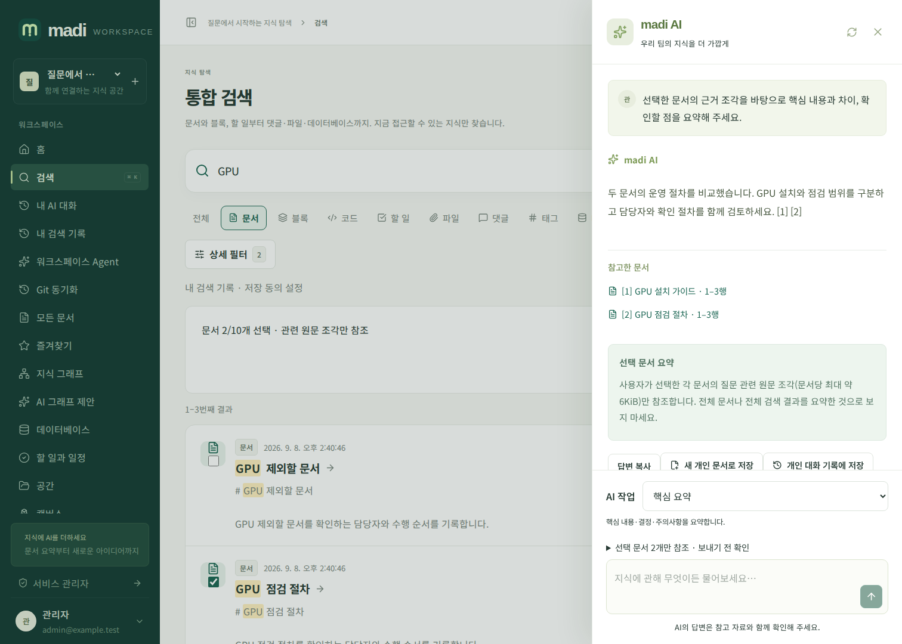

# 자연어 검색과 선택 문서 요약

## 질문을 검색 조건으로 바꾸기

`검색 → 자연어 검색`에서 찾고 싶은 내용을 입력합니다. 질문을 관리자가 설정한 AI 공급자에 전송한다는 동의를 선택하고 `검색 조건 제안`을 누릅니다. 이 단계에는 문서 목록·본문·사용자 명단을 보내지 않습니다. 스트리밍되는 모델 응답은 아직 검색 결과가 아니며, 서버가 검색어·종류·태그·상태·기간·정렬의 닫힌 스키마를 검증합니다. SQL이나 임의 API 호출은 지원하지 않습니다.

제안된 조건과 설명을 검토한 뒤 `조건 확인 후 검색`을 누릅니다. 기존 공간·소유자 필터는 유지하고 나머지 조건을 적용합니다. 날짜는 UTC 수정일 기준으로 시작일과 종료일을 모두 포함합니다. 작성자나 공간 이름이 모호하면 직접 상세 필터에서 선택하세요. 검색 URL을 새로고침해도 조건이 유지됩니다.

AI 설정·사용자 세션·워크스페이스 권한이 바뀌면 출력 중에도 재검사하여 제안을 폐기합니다. 조용한 스트림도 1초 간격으로 검사하고 연결을 취소합니다. 완료되지 않은 제안은 적용할 수 없습니다. 질문 원문은 공용 감사로그에 저장하지 않습니다. 개인 사용자 쿠키 세션으로만 사용할 수 있으며 API 키·플러그인에서 개인용 제안을 생성하지 않습니다.

## 검색한 문서만 요약하기

검색 결과의 `문서` 항목에서 체크박스로 최대 10개를 선택하고 `선택 문서 AI 요약`을 엽니다. 선택만으로 모델을 호출하지 않으며 AI 도우미의 질문을 검토하고 보내기를 눌러야 합니다.

선택한 각 문서에서 질문과 관련된 원문 조각 하나(약 6KiB)를 인용합니다. 선택하지 않은 문서로 검색 범위를 넓히거나 벡터 검색을 자동 호출하지 않습니다. 문서 전체를 모두 읽은 요약이나 전체 워크스페이스 분석으로 해석하지 마세요. 선택 이후 문서 버전이나 권한이 바뀌면 모델 전송 전에 거부하므로 검색 결과를 새로고침해야 합니다. 전송 후 변경에도 기존 AI 스트림의 현재 권한·버전·공급자 검사를 적용합니다.

답변의 `[1]`, `[2]` 출처 버튼으로 정확한 원문 범위와 해시를 확인할 수 있습니다. 명시적 새 개인 초안 저장과 개인 대화 기록 저장은 일반 [AI 문서 작업 가이드](ai-writing-guide.md)의 동의·권한·크기 제한을 동일하게 적용합니다.

## 검색 순위

기본 키워드 검색은 제목·태그·본문 적합도에 최근 수정, 내 즐겨찾기, 최근 30일의 열람 인기도를 소폭 더합니다. 인기도는 최근 256회 안의 서로 다른 열람자 수를 제한적으로 사용하므로 같은 사용자의 반복 열람만으로 가중치를 쌓지 않습니다. 다른 사용자의 이름이나 열람 이력은 검색 결과에 공개하지 않습니다. 모든 결과에는 현재 문서·공간·데이터베이스 권한을 적용합니다.
