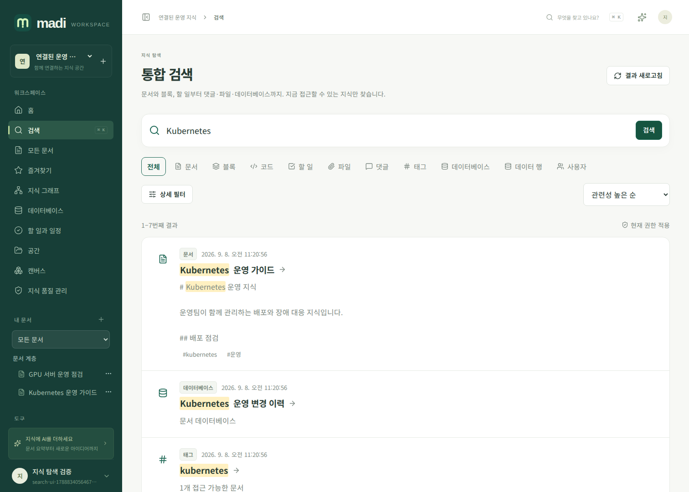
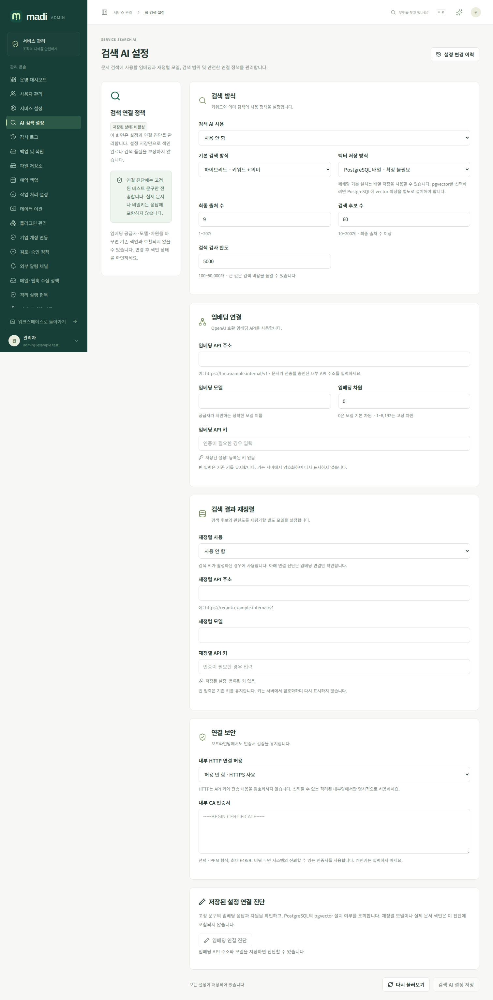
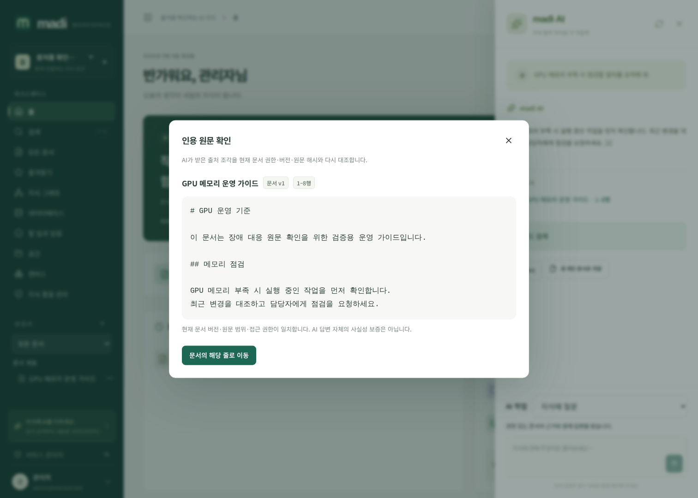

# 검색과 AI 출처 확인

madi의 기본 검색은 PostgreSQL 안에서 동작합니다. 임베딩·재정렬·대화 생성 공급자는 각각 관리자가 연결하며, 인터넷 서비스를 사용하지 않고 내부 모델 서버만 지정할 수 있습니다. [AI 문서 작업·개인 대화 기록](ai-writing-guide.md), [자연어 검색·선택 문서 요약](natural-search-guide.md), [그래프 AI 제안](graph-ai-guide.md)은 별도 가이드에서 설명합니다.

## 통합 검색

사용자 메뉴의 **검색**(`/app/search`)에서 문서, 블록, 코드, 할 일, 파일 이름, 댓글, 태그, 데이터베이스, 데이터 행, 사용자를 찾습니다. 작성자·공간·태그·문서 상태·UTC 기간·첨부 여부·종류와 정렬을 조합할 수 있습니다. URL에 검색 조건과 페이지가 남으므로 새로고침해도 유지됩니다.

문서 관련 결과는 상위 문서와 공간을 포함한 현재 열람 권한으로 제한됩니다. 데이터베이스 검색에는 별도 `database:read` 키 권한이 필요합니다. 사용자 결과는 제한 없는 로그인 세션에서만 제공됩니다. v0.2.0에서 관리자가 켠 [첨부 본문 추출](attachment-extraction-guide.md)은 최신의 허용된 PDF/Office/OCR 구간도 검색하며 원본 위치를 제공합니다. 미추출·미지원 파일 전체가 자동 검색된다는 뜻은 아닙니다.

블록·코드·작업 결과는 문서의 해당 원문 줄로 이동합니다. 제목·태그·키워드 관련도, 최신성, 개인 즐겨찾기와 최근 30일의 서로 다른 조회자 수를 제한적으로 가중합니다. 같은 사용자의 반복 조회는 인기도를 계속 높이지 않으며 독자 신원은 공개하지 않습니다. 결과는 페이지당 최대 100개, offset은 10,000까지입니다. 정확한 전체 건수를 제공한다는 의미는 아닙니다. 검색어 기록은 기본 비활성이고 [개인 검색 기록](personal-search-guide.md)에 별도 동의한 경우만 저장합니다.

조직 용어·띄어쓰기 해석, 같은 문서 결과 묶기, 커서와 실패 진단은 [한국어 검색 운영 가이드](search-operations-guide.md)에 있습니다. 검색 결과 옆의 미리보기를 닫으면 원래 선택과 검색 조건으로 돌아갑니다. 검색어가 같더라도 날짜·필터·현재 권한에 따라 결과가 달라질 수 있습니다.

## 로컬 색인과 외부 색인의 차이

문서를 저장하면 로컬 PostgreSQL 검색 큐에 같은 트랜잭션으로 등록됩니다. 원문 조각은 현재 문서 버전·UTF-8 바이트·행 위치·해시를 보존합니다. 오래된 버전의 투영은 검색에서 제외되며 백업 복원 후 재구축됩니다. 이 작업만으로 외부 AI에 원문을 보내지는 않습니다.

외부 임베딩은 문서별 동의가 필요합니다. 관리자 설정에서 공급자를 활성화하는 것만으로 개인 문서를 색인하지 않습니다. 서비스 관리자도 개인 문서 ACL을 우회하지 않습니다.

## 관리자 AI 검색 설정

서비스 전체 기본값은 `/admin/search-ai`, 워크스페이스별 값은 `/app/search-ai-settings`에서 설정합니다. 워크스페이스 관리자는 각 항목을 상속하거나 재정의할 수 있습니다.

| 항목 | 의미 |
| --- | --- |
| 임베딩 주소·모델·키 | OpenAI 호환 `/embeddings` 공급자 |
| 차원 | 0이면 공급자 기본값, 지정 시 1~8192 |
| HTTP 허용 | 기본 끔. 내부 HTTP 서버가 필요한 경우 명시적으로 켬 |
| 사설 CA | HTTPS 검증용 PEM 인증서. 검증 생략 옵션은 없음 |
| 검색 방식 | 키워드·의미·통합 검색 |
| 벡터 저장·검색 | 기본 배열 코사인, 선택 pgvector |
| 결과·후보·검사 한도 | 반환 결과 1~20, 후보 10~200, 검사 100~50,000 조각 |
| 재정렬 공급자 | 선택 사항. 주소·모델·키 및 문서별 별도 전송 동의 필요 |

API 키는 DB에 암호화하여 저장하고 조회 응답에 원문을 넣지 않습니다. 빈 비밀 입력은 기존 값을 유지합니다. 워크스페이스에서 공급자 주소를 바꾸면 다른 주소로 서비스 기본 키가 전달되지 않도록 키 상속을 끊습니다. 삭제·상속 전환은 화면의 명시적 제어로 수행합니다.

**저장된 연결 진단**은 고정된 비민감 한국어 문구만 임베딩 공급자로 보냅니다. 사용자 문서를 진단용으로 자동 전송하지 않습니다. 모델이 실제로 지원하는 차원·인증·인증서·네트워크는 이 진단과 운영 모델의 계약으로 확인하세요.

## 문서별 임베딩 동의

문서 도구의 **AI 검색 색인**을 엽니다. 현재 저장본 버전과 실제 공급자 주소·모델·지문을 확인한 뒤 전송에 동의합니다. 저장하지 않은 편집 초안은 이 작업에 포함되지 않습니다.

- 문서 작성 권한과 `ai:execute` 권한이 모두 필요합니다.
- 자동 재색인과 재정렬 전송은 각각 별도 선택이며 기본 꺼짐입니다.
- 자동 재색인은 같은 승인 공급자에만 적용됩니다. 주소·모델·키·차원·CA 등이 바뀌면 다시 동의해야 합니다.
- 작업은 PostgreSQL 큐에서 실행되며 진행률·실패·중지·재시도를 확인합니다. 모든 조각이 완료되기 전 색인을 검색에 사용하지 않습니다.
- 문서 버전·권한·키·플러그인 권한·공급자가 바뀌면 처리 중에도 검사를 반복합니다.
- **동의 철회**는 해당 벡터와 자동 재색인을 무효화합니다. 과거에 외부 공급자가 받은 데이터를 그 공급자에서 삭제하는 것은 별도의 운영 절차입니다.
- 백업 복원은 과거 동의를 비활성화하고 벡터를 비웁니다. 새 동의 후 다시 색인합니다.

## pgvector와 재정렬

기본 배열 코사인 검색은 추가 PostgreSQL 확장 없이 동작합니다. 설정된 검사 한도 안에서 후보를 비교하며 한도에 도달하면 UI에 알립니다. 제한된 검사 결과를 전체 워크스페이스의 완전한 최근접 결과로 표현하지 않습니다.

pgvector 모드는 외부 PostgreSQL에 실제 `vector` 확장이 설치되어 있어야 합니다. madi는 운영 DB에 확장을 자동 설치하지 않으며 미설치 상태에서 가짜 pgvector 결과로 대체하지 않습니다. 기본은 허용 범위 내 정확 비교이며 v0.2.0의 [벡터 색인 세대](vector-index-operations-guide.md)에서 별도 동의·검증 후 HNSW 근사 검색을 활성화할 수 있습니다. 권한 적용 후 후보 부족과 정확 검색 대비 결과 차이를 표시하며 대규모 ANN 정확도·SLA를 보증하지 않습니다. IVFFlat을 제공한다고 주장하지 않습니다. 연산자와 확장 계약은 [공식 pgvector 문서](https://github.com/pgvector/pgvector)를 따릅니다.

통합 검색은 키워드와 벡터 순위를 결합합니다. 선택적 재정렬은 [vLLM의 Cohere/Jina 호환 재정렬 계약](https://docs.vllm.ai/en/stable/models/pooling_models/scoring/)을 사용합니다. 반환된 문서 문자열을 신뢰하지 않고, 입력 출처의 중복 없는 인덱스 순서와 정상 숫자 점수를 검증합니다. 현재 ACL 또는 재정렬 공급자 동의가 없는 원문은 보내지 않습니다.

## 스트리밍 답변과 인용

기본 AI 대화 설정은 서비스 설정의 AI 항목과 워크스페이스 설정에서 관리합니다. 생성 요청은 SSE 스트리밍이며 관리자 최대 출력 토큰 범위는 1~262144입니다. 256Ki 토큰 값을 전달할 수 있다는 뜻이며 모든 모델이 이 출력량·컨텍스트 길이를 지원한다는 뜻은 아닙니다. 실제 모델 한도를 별도로 확인하세요.

임베딩은 스트리밍 대화와 다른 JSON API입니다. `model`, 문자열 배열 `input`, `encoding_format: float` 및 선택적 `dimensions`를 전달하고 `data[].index`로 입력과 벡터를 대응시킵니다. [공식 OpenAI 임베딩 API](https://developers.openai.com/api/reference/ruby/resources/embeddings/methods/create)를 참고하세요.

답변 아래의 번호가 있는 출처를 누르면 **인용 원문 확인** 창이 열립니다. 서버는 현재 접근 권한·문서 버전·UTF-8 바이트 범위·SHA-256 해시를 다시 확인하고 AI가 받은 원문 조각을 보여줍니다. 원문이 바뀌면 오래된 인용을 보여주지 않고 답변을 다시 생성하도록 안내합니다.

이 검사는 출처 조각과 원문의 일치 여부를 확인합니다. 모델의 추론·주장 전체가 참임을 보증하지는 않습니다. 중요한 답변은 원문을 직접 확인하세요.

처리 중 세션·키·문서·색인 동의·공급자 설정이 무효화되면 이후 텍스트를 중지하고 `retract` 이벤트를 반환합니다. 연동 클라이언트도 이 이벤트를 받으면 기존 답변과 출처를 지워야 합니다.

## API 요약

| 경로 | 동작 |
| --- | --- |
| `GET /api/v1/search` | 권한 기반 통합 검색 |
| `GET /api/v1/search/index-status` | 현재 열람 범위의 로컬 색인 상태 |
| `GET /api/v1/documents/{id}/rag-index` | 공급자·색인·동의 상태 |
| `POST /api/v1/documents/{id}/rag-index` | 버전·지문·명시 동의와 색인 작업 등록 |
| `DELETE /api/v1/documents/{id}/rag-index` | `grant_revision`으로 동의 철회 |
| `POST /api/v1/ai/chat` | 출처·검색 진단과 답변 SSE |
| `GET /api/v1/documents/{id}/citation` | 버전·범위·해시 인용 재검증 |

세부 JSON 계약은 서비스의 OpenAPI를 사용하세요. 환경변수 추가 없이 관리자·개인·워크스페이스 설정으로 운영합니다.
