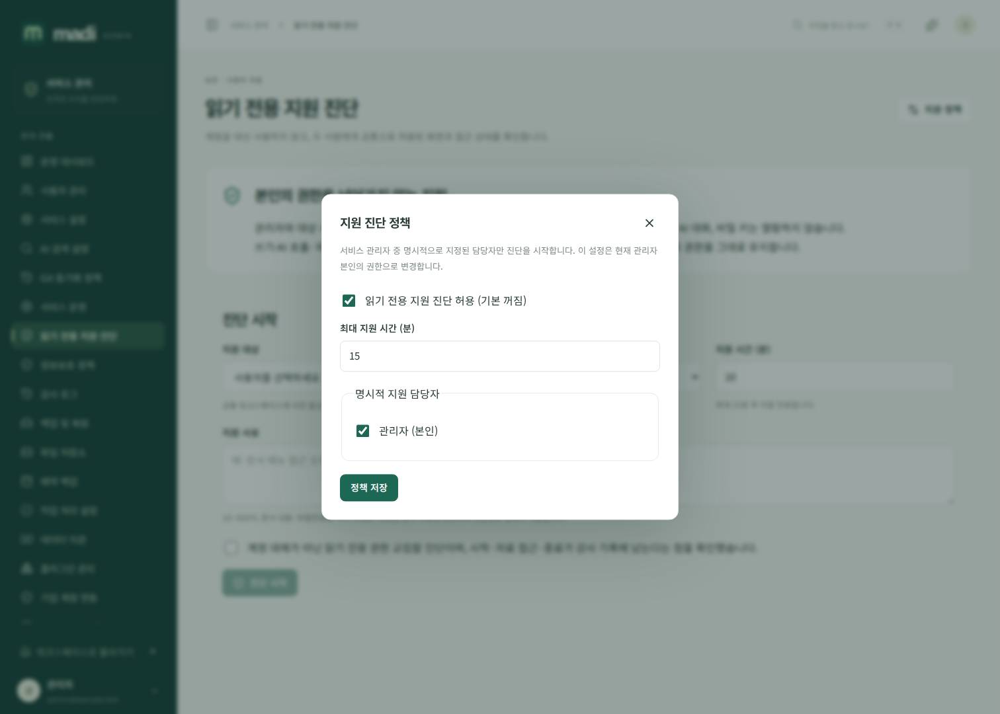
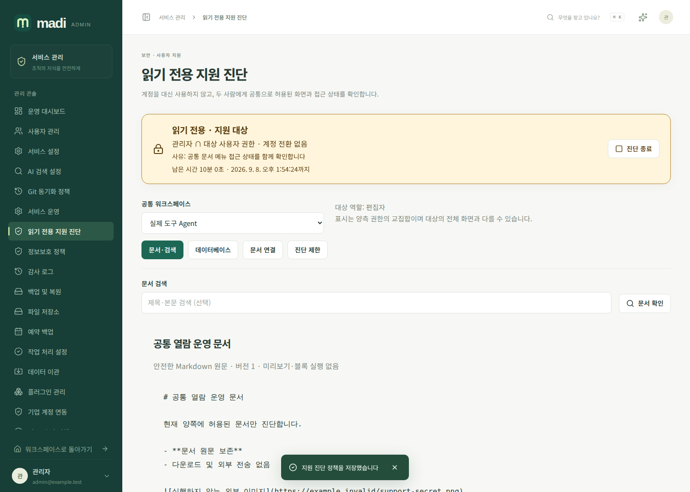

# 읽기 전용 지원 진단

`/admin/support`는 사용자 계정을 대신 사용하는 기능이 아닙니다. 서비스 관리자의 원래 로그인은 그대로 유지하면서 **관리자와 대상 사용자가 모두 현재 열람할 수 있는 정보**만 별도 진단 화면에 표시합니다.

## 설정과 시작

1. 서비스 관리 → 읽기 전용 지원 진단 → **지원 정책**을 엽니다.
2. 기본 꺼짐인 기능을 켜고, 활성 서비스 관리자 중 지원 담당자를 명시적으로 선택합니다.
3. 최대 지원 시간(1~30분)을 정합니다. 설정 변경은 관리자 본인의 권한으로 감사 기록에 남습니다.
4. 공통 워크스페이스에 속한 활성 일반 사용자를 선택합니다. 대상의 이메일·SSO 식별자는 진단 대상 선택에 노출하지 않습니다.
5. 사유 10~500자와 허용된 시간을 입력하고 읽기 전용·감사 기록 안내를 확인한 뒤 시작합니다. 사유에 비밀번호나 문서 원문을 넣지 마세요. 정보보호의 차단·마스킹·경고·감사 정책이 적용됩니다.

동시에 열 수 있는 진단은 담당자당 3개입니다. 진단은 시작한 원래 로그인 쿠키에 결합되므로 같은 관리자로 다른 브라우저에 로그인해도 재사용할 수 없습니다. 로그아웃·계정 비활성화·지원 권한 해제·정책 비활성화·시간 만료 시 더 이상 사용할 수 없습니다.

## 진단 화면

지속 배너에는 대상, 읽기 전용 표시, 사유, 남은 시간과 즉시 종료 버튼이 있습니다. 새로고침해도 URL의 진단 ID로 현재 권한을 다시 확인합니다. 원문은 새로 조회해야 합니다.

- **문서·검색:** 양측의 워크스페이스·공간·문서 조상 권한을 모두 확인합니다. 두 사람 모두 기존 권한이 있는 지정 사용자 공유 문서는 허용됩니다. 타인의 개인 문서에 대한 관리자 우회는 없습니다.
- **문서 원문:** 안전한 텍스트로만 표시합니다. Markdown의 HTML·이미지·링크·플러그인·동기화 블록을 실행하지 않습니다.
- **데이터베이스:** 양측 권한을 만족하는 DB만 조회합니다. 관계·롤업·수식의 실제 참조 대상도 검사하며, 허용되지 않은 계산은 값 대신 오류 설명을 표시합니다. 버튼 속성은 실행하지 않습니다.
- **문서 연결:** 양쪽 모두 읽을 수 있는 문서 사이의 연결만 표시합니다. 권한 없는 문서 이름이나 미해결 링크를 노출하지 않습니다.
- **진단 제한:** 대상 역할과 제한을 확인합니다. 역할은 참고용이며 관리자에게 새로 부여되지 않습니다. 교집합 화면이므로 대상 사용자가 실제로 보는 전체 화면과는 다를 수 있습니다.

표시 중인 문서와 참조 DB의 권한을 0.5초마다 확인합니다. 확인 요청이 1초 안에 완료되지 않거나 권한이 회수되면 기존 표시 내용을 지웁니다. 브라우저가 탭을 숨겼다고 알려도 내용은 제거됩니다. 지원 화면은 민감 원문을 LocalStorage에 저장하지 않습니다.

## 금지되는 동작과 정확한 보안 범위

지원 API에는 문서 쓰기, 댓글·승인, AI 실행, 외부 전송, 첨부 다운로드, 키·SSO·개인 설정 변경, 개인 AI 대화 열람 기능이 없습니다. 지원 진단을 활성화해도 다른 탭이나 일반 서비스 API가 대상 사용자로 바뀌지 않습니다. 원래 관리자는 일반 화면에서 **자신에게 원래 있던 권한**으로 계속 작업할 수 있습니다.

이는 관리자 브라우저 전체를 쓰기 금지하는 보안 샌드박스나 사용자 화면의 완전한 복제가 아닙니다. 또한 이미 권한을 가지고 읽은 화면을 사용자가 별도로 촬영하는 것을 막는 DRM 기능이 아닙니다. 제한된 진단 API와 지속적인 현재 권한 확인을 제공하는 기능입니다.

## 감사·만료·복원

`SUPPORT_START`, `SUPPORT_DOCUMENT_LIST`, `SUPPORT_DOCUMENT_READ`, `SUPPORT_DATABASE_LIST`, `SUPPORT_DATABASE_READ`, `SUPPORT_GRAPH_READ`, `SUPPORT_FORBIDDEN`, `SUPPORT_ACCESS`, `SUPPORT_END`, `SUPPORT_EXPIRED`를 감사 로그에서 확인할 수 있습니다. 원래 관리자, 대상 ID, 사유, 자료 ID, 결과와 시간이 기록됩니다. 문서 본문이나 DB 셀 값은 감사 로그에 넣지 않습니다.

자료 접근은 감사 기록 저장이 실패하면 응답하지 않습니다. 내용 없는 정상 heartbeat는 별도 접근 감사 기록을 매번 만들지 않습니다. 사용자가 명시적으로 종료하지 않은 만료 진단도 유지관리 작업이 종료 기록을 한 번 남깁니다. 접근 차단은 유지관리 주기를 기다리지 않고 매 요청에 적용됩니다.

백업 복원 시 활성 진단은 취소되고 원 로그인 연결 정보가 제거됩니다. 지원 기능도 꺼집니다. 운영자가 다시 정책을 확인하고 새 진단을 시작해야 합니다.

## 범위 제한

문서·DB 목록 각각 100개, DB 조회 최대 100행·응답 4MiB·참조 DB 100개입니다. 연결 진단은 100문서, 문서당 앞 32,000자와 실제 alias 최대 32개(UTF-8 200바이트·JSON 256바이트 이하), 500연결까지만 살펴봅니다. 생략이 있으면 `truncated` 및 화면 안내로 표시합니다. 이 화면은 전체 지식 분석이나 대용량 데이터 내보내기 도구가 아닙니다.

## API

모든 경로는 `/api/v1` 아래에 있습니다. 쿠키 세션 전용이며 상태 변경에는 `X-Madi-Request: 1`과 동일 Origin이 필요합니다.

| 경로 | 기능 |
| --- | --- |
| `GET /support/meta` | 현재 진단 허용 여부·시간 제한 |
| `GET /support/targets?q=` | 필요한 최소 정보의 지원 대상 목록 |
| `POST /support/sessions` | `{target_id, reason, duration_minutes}`로 시작 |
| `GET /support/sessions` | 본인이 시작한 최근 진단 최대 50개 |
| `GET /support/sessions/{id}` | 현재 계정·지원 정책·공통 워크스페이스 확인 |
| `POST /support/sessions/{id}/end` | 원 로그인에서 즉시 종료 |
| `GET /support/sessions/{id}/documents?workspace_id=&q=` | 권한 교집합 문서 검색 |
| `GET /support/sessions/{id}/documents/{document}` | 안전한 문서 원문 |
| `GET /support/sessions/{id}/databases?workspace_id=` | DB 목록 |
| `GET /support/sessions/{id}/databases/{database}?limit=100` | 참조 권한을 검사한 DB 값 |
| `GET /support/sessions/{id}/graph?workspace_id=` | 제한된 문서 연결 |

현재 진단 조회의 선택 쿼리 `document_ids`, `database_ids`에는 표시된 ID를 쉼표로 구분해 전달할 수 있습니다(종류별 최대 101개). `formula_workspace_id`는 표시 중인 계산의 양측 기능 정책도 확인합니다. 이는 화면 회수용 확인이며 자료 접근 권한을 부여하지 않습니다. 각 자료 API는 독립적으로 양측 ACL을 검사합니다.
